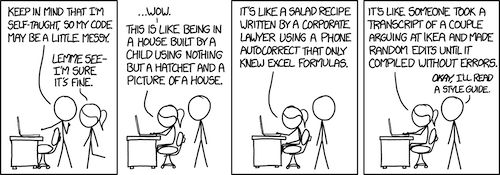
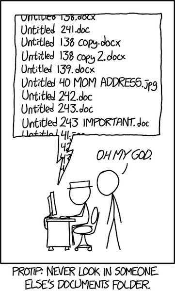

Coding standards are a great way for new programmers to develop best practice habits when starting out. These standards provide a structure, helps with syntax (won’t help with logic), and promotes cohesion within the team. The code conforming to these standards becomes easily readable and reduces downtime and money when new team members join the project. The standards may also reduce unnecessary overhead, like declaring extraneous variables. This may not matter in small scale projects, however, in larger projects, these extra variables may cost memory allocation or processing time.

## The Fine Line
There needs to be a fine balance between conforming to standards and being nit-picky, the letter of the law versus the spirit of the law. I feel that programmers need to honor the coding standards established, but should not be harshly berated because of someone’s personal preference/OCD, for example, comments only at the beginning of the methods or only one return statement. A judgement of whether the code works functionally or does the code look aesthetically pretty. The standards need to be beneficial to all. As Mr. Spock says, “the needs of the many outweigh the needs of the few. Or the one.”

## Standardizing
The coding standards remind me of one of my previous jobs where an engineer attempted to standardize the naming of files to help quickly find project documents in the server. A much needed standard in an organization. After this first week with eslint, I actually like the check for conformity and the warnings and tips provided. The red squiggly lines and yellow warnings make me more cautious when I code and help me develop the better coding habits. However, I would not want to be dinged for not including a space after the word ‘function’ or the indent is 5 spaces not 4.
