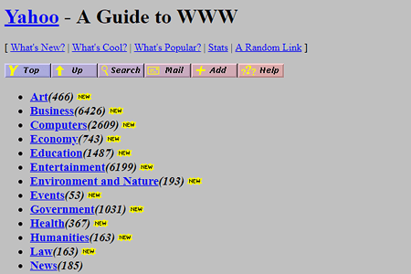

UI Frameworks like Semantic UI are great tools to create attractive modern web applications easily. The features and functions available help front-end developers build webpages more uniformly across all platforms. When linking to the framework, any changes or new features to the UI Framework can easily be implemented with a simple update to the link reference. The framework provides a structure that reduces the amount of extraneous styles or code needed to be written by the developer.

## Responsive
With the advent of mobile and tablet devices, websites need to be developed to adjust to the smaller sizes. UI frameworks are a great way to build pages that can automatically detect and adjust the content to fit the screen.

## Transitions
My experience with HTML and CSS goes back to the late 1990s where websites were boring and unattractive. As smart phones and tablets just started out, I recall needing to include code to detect screen sizes and browser platforms. With the creation of UI frameworks, I saw its robustness in creating beautiful websites. When I used Bootstrap 3, I noticed that I could eliminate a lot of code and styles since it came standard.

When I started learning and using Semantic UI, some of the concepts and elements were the same as Bootstrap. They both control elements and layout through "class". In Semantic UI, the one thing that stood out for me was the "plain English" approach to creating and styling elements. Bootstrap is a bit more prescribed in their classes. For example, in a grid, if I wanted a two wide column in Semantic UI would be class="two wide column" versus in Bootstrap a column would be class="col-sm-2", where sm indicates class for screen size.

Regardless of the nuances between the different frameworks, using them provides consistency and reduces the time needed to control the look and flow and focuses on the function and content of the website. Developers do not need to create from scratch.
