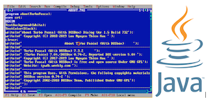

When I first started my academic journey back in the mid 1990s, I was interested in the computer science program and declared it as my major. Computers back then were big, slow, and expensive. The Internet was still being developed and connected to it required the use of a modem and calling the UH modem pool. In 1996, I took my first ICS 111 Computer Science I taught by Dr. Peterson and the coding language was Pascal, a top-down programming language. Dr. Peterson was excellent at teaching all the concepts and using visuals and the blackboard to help student understanding. I recall Dr. Peterson using numbers printed on cardboard tiles and iterating through code to sort numbers in ascending order. 

Life happened and I pursued another degree but wanted to continue learning computer science. In 1999, I took ICS 111 at Kapiolani Community College and was very surprised that the curriculum changed languages to Java. The professor gave me the Java software to install on my computer. Coding was done in Notepad and compiled via the command line. There were no IDEs or developer tools that were used and homework was submitted on a 3.5” floppy disk. This was my first exposure to object oriented programming and it was a very progressive concept.

Fast forward to 2011 and I took ICS 111 at Windward Community College to continue my learning journey and refresh my programming skills. Java was still the language of choice using the command line but there were projects incorporating modern updates like creating basic graphics. 

In 2020, I decided to pursue my second degree in my original major. When I heard about the types of projects recent ICS 111 students created, I was in awe that their projects involved the development of a graphical game. I am very glad to be part of and experience this evolution process.

