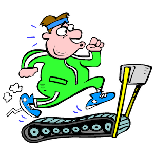

I took an introductory course in web design in 2012 that incorporated Javascript but have not used it extensively in my other programming projects for school and work.

As I reviewed the FreeCodeCamp lessons, I began to recall the syntax and basic concepts. I could see that Javascript is an evolving language that maintains the foundational concepts and adapts to modernized syntax and approaches. Several concepts that I am interested in learning more about are the arrow function, spread, and JSON. 

Javascript is a good language for software engineering because it helps with rapid development and focused user experience. There is seemingly little overhead, like an external database, needed to develop a robust production application.

I believe that the WODs are a great learning technique to develop competency in Javascript. For me, the practice and b- WODs are very stressful because of the psychological effects of seeing the timer. I sweat and mildly hyperventilate. As with physical exercise, practice and exposure will help me to strengthen skills and mitigate the effects of test taking.
